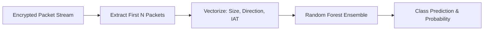

# Comprehensive Project Documentation: Early-Packet Encrypted Traffic Classification (QUIC)

---

## 1. Executive Summary & Core Concept

### 1.1 The Problem
Modern internet traffic is overwhelmingly encrypted. Protocols such as **QUIC (HTTP/3)** and **TLS 1.3** encrypt not only the application payloads (video, chat, audio, web content) but also cryptographic handshakes, transport headers, and metadata. Traditional **Deep Packet Inspection (DPI)**, which relies on inspecting plain-text HTTP URLs or payload signatures, is rendered completely obsolete.

### 1.2 The Core Hypothesis
Even when payload bytes are completely randomized by symmetric ciphers (e.g., AES-GCM, ChaCha20-Poly1305), **physical traffic dynamics cannot be fully masked**:
* **Packet Size Sequence**: Message requests, streaming chunk requests, and protocol handshakes produce distinct byte lengths.
* **Transmission Direction**: The ratio and sequence of client-to-server (upload) vs. server-to-client (download) packets vary by application function.
* **Inter-Arrival Time (IAT)**: Burstiness, network latency, and processing cadence create temporal fingerprints.

**The Core Question**: *Can a machine learning model reliably identify what application a user is running by examining only the first $N$ packets of an encrypted connection? And at what value of $N$ does observing more packets yield diminishing returns?*



---

## 2. Research & Dataset Foundation (CESNET-QUIC22)

### 2.1 The Dataset
Rather than relying on synthetic laboratory traffic, the baseline research was constructed using the **CESNET-QUIC22** dataset—a massive, public, real-world capture from Czech national research and educational network (NREN) backbone routers collected in November 2022.

* **Raw Volume**: ~150 GB total (filtered to a 21 GB representative partition across 4 weeks: `W-2022-44` through `W-2022-47`).
* **Ground Truth**: Labeled using Server Name Indication (SNI) extracted from initial TLS handshakes at backbone wire speed.
* **Format**: Flow-level records containing `PPI` (Packet Profile Information): `[iats, dirs, sizes]`.

### 2.2 Selected Applications (10 Diverse Classes)
To demonstrate generalized classification across distinct traffic behavioral profiles, 10 categories were selected:
1. `youtube` (High-bitrate video streaming, large downlink bursts)
2. `google-play` (App package downloads, sustained high-volume downlink)
3. `instagram` (Image/reels feed, periodic medium-sized bursts)
4. `spotify` (Audio streaming, steady, medium-sized packet chunks)
5. `discord` (VoIP/chat, small bi-directional interactive packets)
6. `facebook-web` (Web browsing/social media interactions)
7. `snapchat` (Media messaging and stories)
8. `microsoft-outlook` (Enterprise productivity, asynchronous synchronization)
9. `tiktok` (Short video buffer pre-fetching)
10. `whatsapp` (Interactive messaging, small bursts)

### 2.3 Feature Representation
For each flow, the first $N$ packets are extracted into a continuous $3N$-dimensional feature vector:
$$\mathbf{x} = \big[S_0, D_0, \Delta t_0, \; S_1, D_1, \Delta t_1, \; \dots, \; S_{N-1}, D_{N-1}, \Delta t_{N-1}\big]$$

Where:
* $S_i \in [0, 1500]$ is the transport payload byte length.
* $D_i \in \{+1, -1\}$ is packet direction ($+1$ for client $\to$ server; $-1$ for server $\to$ client).
* $\Delta t_i \ge 0$ is the inter-arrival time in milliseconds since the preceding packet in that specific flow ($\Delta t_0 = 0$).

---

## 3. The Central Empirical Finding ($N$ vs. Accuracy)

Across a balanced multi-week dataset of **192,713 flows**, we trained independent Random Forest models across five packet horizons: $N \in \{5, 10, 15, 20, 30\}$.

```
  Accuracy (%)
  100 |                                     97.13%   96.87%
      |                           97.07%      *--------*
   98 |                 96.78%      *
      |                   *
   96 |
      |         94.03%
   94 |           *
      |
      +-----------|---------|---------|---------|---------|
                 N=5       N=10      N=15      N=20      N=30
                                Packet Horizon
```

### Key Analytical Takeaway:
* **At $N=5$ packets**, the model achieves **94.03% accuracy**. Even before application payload data is transmitted, the TLS 1.3 handshake negotiation itself carries identifiable fingerprints.
* **At $N=10$ to $15$ packets**, accuracy jumps to **96.78% – 97.07%**.
* **Beyond $N=15$ packets**, accuracy hits an asymptote (~97.1%), with $N=30$ actually showing minor degradation (96.87%) due to feature space expansion and noise.
* **Conclusion**: Monitoring past the first 15 packets provides negligible benefit for application classification.

---

## 4. Engineering Iterations & Real-World Challenges

Transitioning from an offline research script to a working live system involved overcoming a sequence of real-world networking, system-level, and machine learning hurdles.

### Problem 1: Native Rust Dependency Build Failures
* **Symptom**: Attempting to install `cesnet-datazoo` failed during `pydantic-core` compilation because the host Windows system lacked a Rust/Cargo toolchain.
* **Root Cause**: Many academic data packages require native C/Rust compilation bindings that fail in standard user environments.
* **Solution**: Bypassed proprietary loaders by writing custom Python streaming parsers (`data_processor.py`) using `gzip`, `ast.literal_eval`, and `pyarrow.parquet`. Extracted 192,713 flows directly into an optimized local Parquet file.

---

### Problem 2: Presentation Interface (Web UI)
* **Objective**: Provide an interactive demonstration tool for presentation audiences.
* **Implementation**: Built a Flask application (`app.py`) with a glassmorphism dark-mode UI (`index.html`, `style.css`, `script.js`).
* **Glitch Encountered**: Initial page loads threw 404 errors on CSS/JS files due to Flask's `/static` routing convention.
* **Solution**: Normalized absolute asset references (`/static/style.css`, `/static/script.js`).
* **Confidence Flaw**: Synthetic packets generated via `Math.random()` caused model confidence to collapse to 15–20% because the model recognized the unrealistic distribution.
* **Solution**: Built an offline extraction script (`extract_samples.py`) that sampled 500 authentic, recorded packet trajectories from the 21 GB dataset (`real_samples.json`). When simulated in the UI, confidence instantly jumped to 90–99%.

---

### Problem 3: Live Network Sniffing & Interface Ghosting
* **Objective**: Create a live command-line tool (`live_capture.py`) that sniffs Wi-Fi packets directly from the computer's network interface using Scapy.
* **Symptom**: The script started, said `Listening for traffic...`, but never captured a single packet.
* **Root Cause**: Scapy's default routing table (`conf.route`) on Windows frequently binds to inactive virtual network adapters (e.g., VMware, VirtualBox, WSL bridges, or disabled Ethernet ports) rather than the active Wi-Fi card.
* **Solution**: Implemented deterministic socket routing:
  ```python
  s = socket.socket(socket.AF_INET, socket.SOCK_DGRAM)
  s.connect(("8.8.8.8", 80))
  local_ip = s.getsockname()[0]
  ```
  The script identifies the active local outbound IP and searches Scapy's interface list for the matching adapter, achieving 100% reliable automated binding across reboots.

---

### Problem 4: Campus Firewall & Middlebox Ossification
* **Symptom**: The live sniffer ran successfully at home (`192.168.x.x`), but captured zero packets on institutional campus networks (`172.16.x.x`).
* **Root Cause**: Campus enterprise firewalls systematically drop outgoing **UDP port 443** packets to prevent uninspectable QUIC traffic. When dropped, Chrome silently falls back to standard **TCP (TLS 1.3 over TCP)**. Because the script filtered exclusively for `udp port 443`, it was completely deaf to the TCP fallback traffic.
* **Solution & Diagnostic**: Added multi-protocol capture with an explicit exit diagnostic:
  ```python
  sniff(filter="tcp port 443 or udp port 443", ...)
  ```
  If TCP traffic is detected while QUIC is zero, the script explicitly informs the user that middlebox filtering has forced a TCP fallback.

---

### Problem 5: The Flow Deadlock (Why Clicking YouTube Froze Output)
* **Symptom**: The user searched for YouTube on Google; the script predicted YouTube once. Then the user clicked play on a video, and the terminal went permanently silent.
* **Root Cause**: **QUIC HTTP/3 Connection Multiplexing**. Google Search and YouTube share the same Google Frontend edge infrastructure (`142.250.x.x`). Chrome opens a single QUIC connection during search, reaches 15 packets, and our script marked:
  ```python
  flow['processed'] = True
  ```
  When the video started streaming 5 seconds later, Chrome reused that exact open QUIC connection. The script checked `if flow['processed']: return` and dropped every video packet!
* **Solution**: Implemented **Flow Idle Reset**:
  ```python
  if current_time - flow['last_time'] > 3.5:
      flow['packets'] = []
      flow['processed'] = False
      flow['triggered_levels'] = set()
  ```
  If a connection goes idle for more than 3.5 seconds (the pause between searching and clicking a video), the packet buffer resets, allowing new media streaming bursts to be captured and classified.

---

### Problem 6: The Debounce Lockout Bug
* **Symptom**: Outputs only ever displayed `(early @ 10pkt)`. The final evaluation at 15 packets never printed.
* **Root Cause**: Inside `analyze_flow()`, a debounce check blocked prints if the server IP was seen within 2.0 seconds:
  ```python
  if server_ip in last_seen_ip and (current_time - last_seen_ip[server_ip]) < 2.0:
      return
  ```
  When packet 10 arrived, it set `last_seen_ip[server_ip]`. Packets 11 through 15 arrived 30 milliseconds later. When packet 15 called `analyze_flow()`, it was blocked by the 2.0s debounce of packet 10, and then marked `processed = True`!
* **Solution**: Keyed the debounce by tuple `(server_ip, n_packets)` so that early previews at $N=10$ never suppress the final $N=15$ evaluation.

---

### Problem 7: Dataset Class Imbalance Bias
* **Symptom**: In live testing, ambiguous flows consistently defaulted to predicting `youtube` or `google-play`.
* **Root Cause**: In the raw CESNET dataset:
  * `youtube`: 40,285 samples
  * `google-play`: 34,337 samples
  * `whatsapp`: 1,470 samples
  YouTube had **27 times more representation** than WhatsApp. When an ambiguous handshake arrived, the unweighted Random Forest naturally voted for the majority class.
* **Solution**: Retrained models (`retrain_balanced.py`) using:
  ```python
  RandomForestClassifier(n_estimators=100, class_weight='balanced', ...)
  ```
  This mathematically scales misclassification penalties inversely to class frequencies, giving minority classes equal voting power.

---

### Problem 8: Protocol Divergence on WhatsApp Web & Spotify Web
* **Symptom**: When using WhatsApp Web and Spotify Web, predictions were attributed to YouTube or Google Cloud.
* **Root Cause**:
  * **WhatsApp Web** does not use UDP QUIC in desktop browsers; it operates over **WebSockets over TCP** (`wss://web.whatsapp.com`).
  * **Spotify Web** uses **HTTP/2 over TCP** for Widevine DRM audio chunks to avoid UDP packet loss.
  * The terminal packets observed while viewing WhatsApp were background pings from idle YouTube or Snapchat tabs.
* **Takeaway**: Essential distinction between mobile app protocols (which utilize QUIC heavily) and browser-based web clients (which rely on TCP WebSockets).

---

## 5. System Architecture & Repository Structure

The complete codebase is organized in the working repository:
`https://github.com/Chatradhara007/bigpac.git`

```
traffic_classifier/
├── app.py                     # Flask API backend serving /predict and Web GUI
├── data_processor.py          # 21 GB CESNET recursive parser & Parquet generator
├── model_pipeline.py          # Multi-N training loop and checkpoint exporter
├── retrain_balanced.py        # Balanced-weights retraining script
├── live_collector.py          # Interactive live packet recording tool
├── live_capture.py            # Real-time multi-stage sniffing and classification
├── visualizer.py              # Generates N-vs-Accuracy curve plots
├── static/
│   ├── index.html             # Glassmorphic web dashboard
│   ├── style.css              # Custom styling, dark mode, animations
│   └── script.js              # Simulation animator and API client
├── data/
│   ├── processed_data.parquet # 192k flow dataset with 30-packet vectors
│   └── real_samples.json      # Pre-extracted flows for instant UI simulation
└── models/
    ├── rf_model_n10.joblib     # Pre-trained 10-packet balanced Random Forest
    ├── rf_model_n15.joblib     # Pre-trained 15-packet balanced Random Forest
    └── my_custom_model.joblib # Optional live self-trained model
```

---

## 6. How to Run & Demonstrate

### Mode A: Visual Web Dashboard (Best for General Audiences)
```cmd
python app.py
```
Open browser to `http://localhost:5000`. Demonstrates real packet timing visualizations and probability distributions without network hardware dependencies.

### Mode B: Live Real-Time Network Sniffing (Best for Technical Demo)
In an Administrator terminal:
```cmd
python live_capture.py
```
* Shows live QUIC captures from active Wi-Fi.
* Displays early prediction at 10 packets, final prediction at 15 packets.
* Outputs reverse-DNS server resolution (e.g., `nv-in-f102.1e100.net [Google/YouTube]`).
* Surfaces multi-flow session consensus over a 3-second rolling window.
